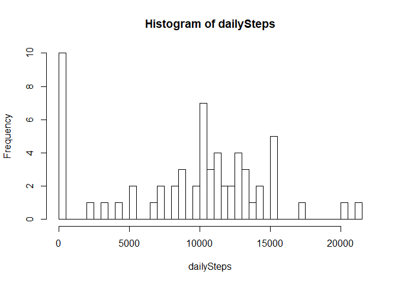
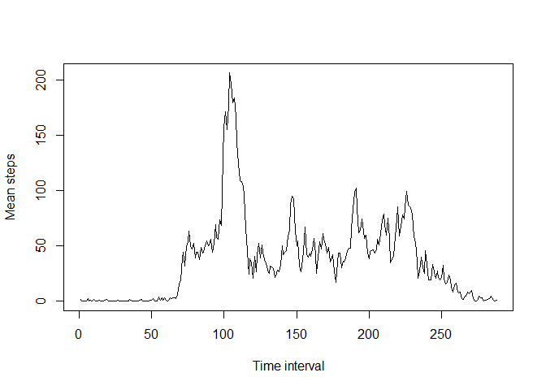
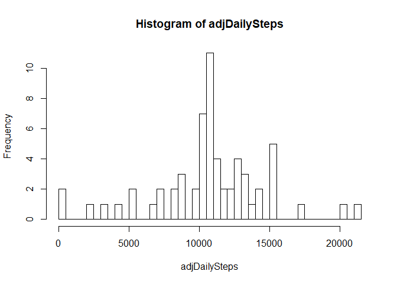

## Loading and preprocessing the data

```r
rawData = read.csv("activity.csv", stringsAsFactors = FALSE)
```


## What is mean total number of steps taken per day?

```r
dailySteps = tapply(as.numeric(rawData$steps), rawData$date, sum, na.rm = TRUE)
hist(dailySteps)
```

<!-- -->

```r
summary(dailySteps) # Contains median and mean
```

```
##    Min. 1st Qu.  Median    Mean 3rd Qu.    Max. 
##       0    6778   10395    9354   12811   21194
```


## What is the average daily activity pattern?

```r
meanTimeSteps = tapply(as.numeric(rawData$steps), rawData$interval, mean, na.rm = TRUE)
plot(meanTimeSteps, type = "l", xlab = "Time interval", ylab = "Mean steps")
```

<!-- -->


```r
## Get the 5-minute interval name which contains the maximum number of steps.
names(which(meanTimeSteps == max(meanTimeSteps)))
```

```
## [1] "835"
```


## Imputing missing values

```r
## Calculate total number of missing values in the dataset.
sum(is.na(rawData))
```

```
## [1] 2304
```

```r
## NAs are replaced by the means for that 5-minute interval
adjData = rawData
adjData$steps[is.na(adjData$steps)] = tapply(as.numeric(adjData$steps), adjData$interval, mean, na.rm = TRUE)

adjDailySteps = tapply(as.numeric(adjData$steps), adjData$date, sum, na.rm = TRUE)
## histogram
hist(adjDailySteps)
```

<!-- -->

```r
## Mean and median
summary(adjDailySteps)
```

```
##    Min. 1st Qu.  Median    Mean 3rd Qu.    Max. 
##      41    9819   10766   10766   12811   21194
```


## Are there differences in activity patterns between weekdays and weekends?
